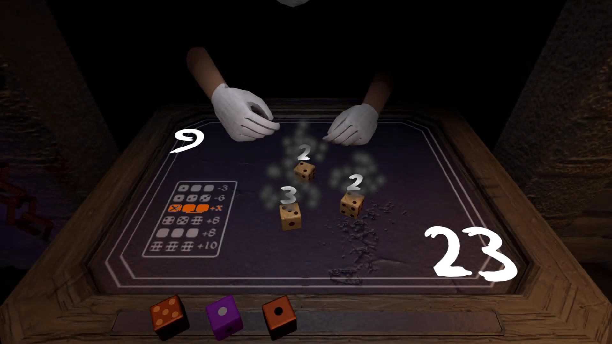
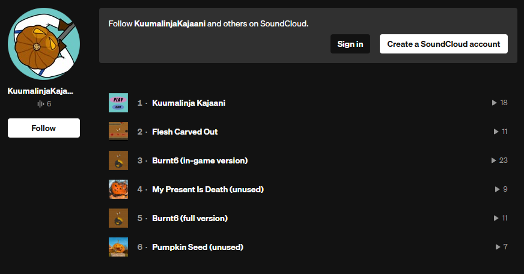
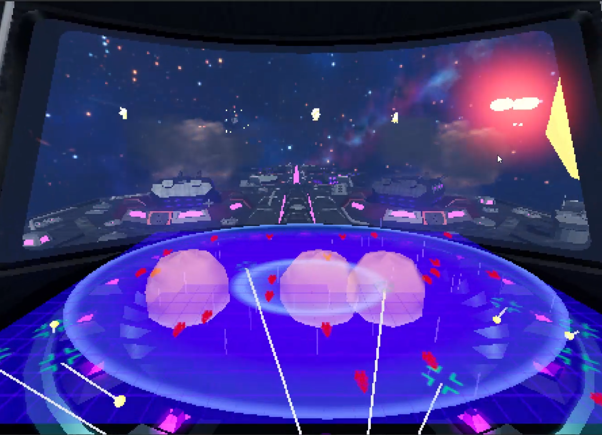

# Who am I?

  
  
  
   
  
  My name is Artturi Vuorinen, and I'm a game developer from Finland who also has a passion for music and audio.
  
   
  

# School projects

  
<b>Strung Flowers | Windows 10 - 11 Game</b>

  
  

    
    
  

  
  

    
  3D Dice deckbuilder roguelike made with Unity.
    
  

  

  
<b>Kuumalinja Kajaani | Game Soundtrack</b>

  
  

    
    
  

  
  

    
  A Hotline Miami-inspired game with Halloween and Christmas themes.
    
  

  

  
<b>Spaceship Cannoneer | Windows 10 - 11 Game</b>

  
  

      
    
  

  
  

    
  A Hotline Miami-inspired game with Halloween and Christmas themes.
    
  

  

# Personal projects

 

# Other

  
  
<b>Social media</b>

  
  

    
  

  
  
  

