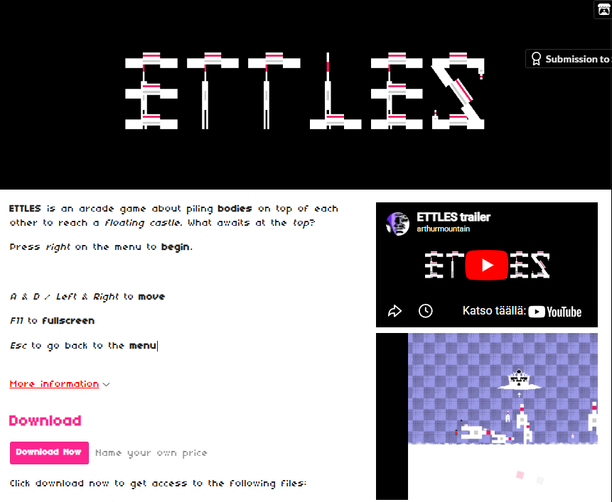
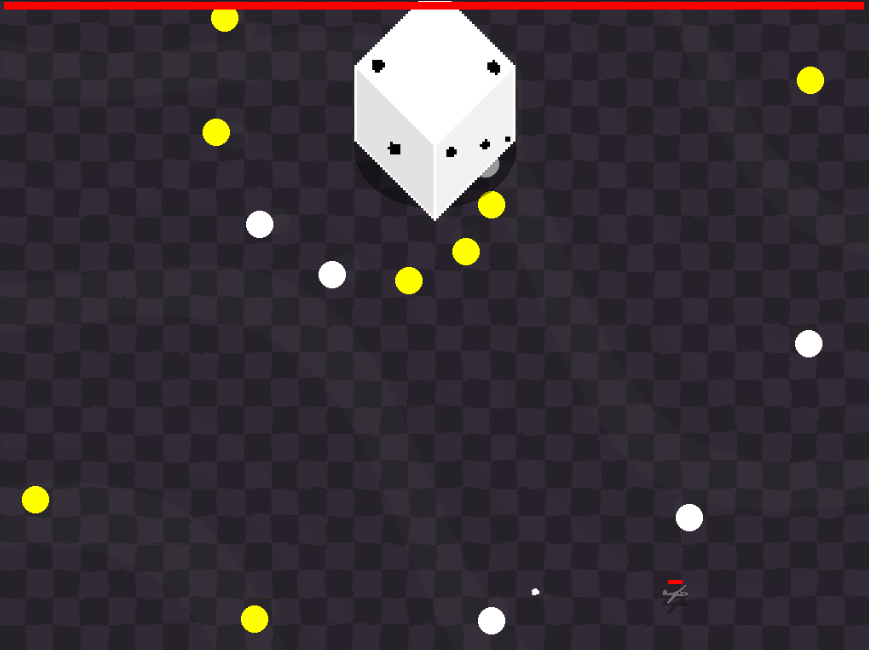

# Who am I?

  
  
  
   
  
  My name is Artturi Vuorinen, and I'm a game developer from Finland who also has a passion for music and audio.
  

# School projects

  
<b>Strung Flowers | Windows 10 - 11 Game</b>

   
  

    
    
  

  
  

    
  3D Dice deckbuilder roguelike made with Unity.
    
  

  
<b>My role in the project</b>

  
  <ul>
  <li><b>Team Lead:</b> Lead the team creating the game</li>
  <li><b>Game Design:</b> Designed the original idea and contributed to core gameplay mechanics</li>
  <li><b>Programming:</b> Created systems for the game using C#</li>
  <li><b>Audio:</b> Made music and sound effects</li>
  </ul>
  

  
<b>Spaceship Cannoneer | Windows 10 - 11 Game</b>

   
  

      
    
  

  
  

    
  A strategic space shooter.
    
  

  
<b>My role in the project</b>

  
  <ul>
  <li><b>Programming:</b> Prototyped and coded various things using GDScript</li>
  </ul>
  

  
<b>Kuumalinja Kajaani | Game Soundtrack</b>

   
  

    
    
  

  
  

    
  A Hotline Miami-inspired game with Halloween and Christmas themes.
    
  

  
<b>My role in the project</b>

  
  <ul>
  <li><b>Audio:</b> Made the game's soundtrack and audio effects</li>
  </ul>
  

# Personal projects

  
<b>ETTLES | Windows 10 - 11 Game</b>

   
  

    
    
  

  
  

    
  A short arcade game made for the Sealed With A Kiss Jam 2026.
    
  

  
<b>My role in the project</b>

  
  <ul>
  <li><b>All:</b> Made everything in the game from scratch</li>
  </ul>
  

# Other

  
<b>Arthur Mountain's Boss Rush | Upcoming Steam release</b>

   
  

      
    </a>
    
  

  
  

    
  An 8-bit retro arcade shooter focused on boss battles.
    
  

  <ul>
  <li><b>All:</b> Made everything in the game from scratch, and am further developing it for release</li>
  </ul>
  

  
  
<b>Social media</b>

  

    
  

  
  
  

